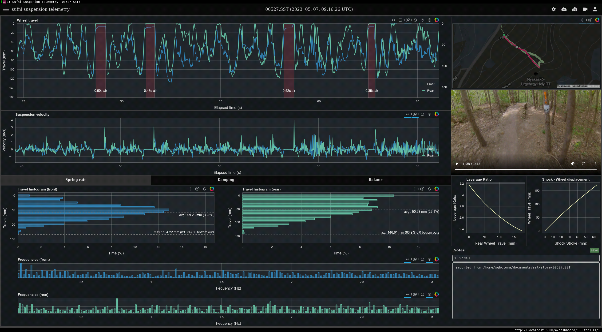

Телеметрия
==========================

Sufni\* Suspension Telemetry е телеметрична система за окачване на планински велосипеди, която
се роди от чисто любопитство. [Единицата за събиране на данни](https://github.com/sghctoma/sst/wiki/02-Data-Acquisition-Unit) е изградена около
Raspberry Pi Pico W и използва достъпни готови компоненти, така че всеки може да
с малко умения за запояване може да я изгради.

За разлика от повечето (всички?) системи за телеметрия на окачването, Sufni използва ротационни енкодери
за измерване на движението. Те са евтини, сравнително точни и могат да достигнат доста
висока честота на дискретизация. Допълнително предимство е, че при някои рамки те са по-лесни
на задните амортисьори, отколкото линейните сензори, защото могат да се вместят в много
по-малки пространства.

DAQ използва WiFi мрежа за изпращане на записаните сесии към основния сървър.
Когато обработката приключи, данните могат да бъдат анализирани в [уеб потребителски интерфейс](https://github.com/sghctoma/sst/wiki/03-Dashboard), който
предоставя диаграми, полезни за настройване на пружината, амортизацията и велосипеда.
цялостния баланс. Могат да се качват и GPX тракове, както и да се отварят MP4 видеоклипове
от локалната машина. Те се синхронизират с графиката на пътуването, така че можете да
лесно да откриете как се е държало окачването ви на определена част от пътеката.

Потребителският интерфейс има две допълнителни функционалности:

 - Могат да се създават нови настройки на велосипеда и те могат да се свързват с DAQ устройство.
   на базата на уникалния идентификатор на Pico.
 - Могат да се добавят и нормализирани данни (процент от пътуването или число между 0 и 1).
   [импортирани](https://github.com/sghctoma/sst/wiki/04-Importing-normalized-data) от CSV файлове, така че можете да използвате уеб приложението, без да сте обвързани с
   хардуера на Sufni.

Моля, направете справка в уикито за [ръководство за бърз старт](https://github.com/sghctoma/sst/wiki/01-Quickstart-guide), инструкции за изграждане и пълен
на потребителския интерфейс, графиките и т.н.
